## Concept Map

### 🏷️ Skill Anatomy

- **[[Skill]]**
  - → uses: [[YAML Frontmatter]]
  - → enables: [[Progressive Disclosure]]
- **[[YAML Frontmatter]]**
  - → part of: [[Skill Description Field]]

### 🏷️ Design Principles

- **[[Progressive Disclosure]]**
  - → based on: [[YAML Frontmatter]]
- **[[MCP (Model Context Protocol)]]**
  - → extends: [[Skill]]
- **[[Skill Description Field]]**
  - → enables: [[Testing Strategy]]

### 🏷️ Planning & Use Cases

- **[[Skill Use Case Categories]]**
  - → based on: [[Use Case Definition & Success Criteria]]
  - → enables: [[Workflow Patterns]]
- **[[Use Case Definition & Success Criteria]]**
  - → enables: [[Skill Description Field]]

### 🏷️ Testing & Iteration

- **[[Testing Strategy]]**
  - → enables: [[Skill Iteration]]
- **[[Skill Iteration]]**
  - → extends: [[Skill Description Field]]

### 🏷️ Distribution

- **[[Distribution Model]]**
  - → extends: [[Open Standard & Skills API]]
- **[[Open Standard & Skills API]]**
  - → based on: [[MCP (Model Context Protocol)]]

### 🏷️ Workflow Patterns

- **[[Workflow Patterns]]**
  - → uses: [[MCP (Model Context Protocol)]]

### 🏷️ Troubleshooting

- **[[Troubleshooting Reference]]**
  - → extends: [[Skill Iteration]]

---

## Kernwissen

### Skill

📊 Confidence: `high` | 🏷️ Cluster: Skill Anatomy | 📅 Gültig ab 2025 · Stand 2026-01 (inferred)

**Definition:** A skill is a folder-based instruction package that teaches Claude how to handle specific tasks or workflows. It consists of a required SKILL.md file (Markdown with YAML frontmatter) and optional subdirectories: scripts/ (executable code), references/ (documentation), and assets/ (templates, fonts, icons).

**Warum relevant:** Skills eliminate the need to re-explain preferences and workflows in every conversation. They encode repeatable processes once, making Claude's behavior consistent and automating multi-step workflows. For MCP builders, skills add the knowledge layer on top of raw tool access.

**Beziehungen:**
- → uses: [[YAML Frontmatter]]
- → enables: [[Progressive Disclosure]]

**Kernaussagen:**
- A skill must contain exactly one SKILL.md file (case-sensitive); the folder name must be kebab-case. [1]
- Skills work identically across Claude.ai, Claude Code, and the API without modification.
- Claude can load multiple skills simultaneously; each skill must work alongside others.
- Skills are most powerful for repeatable workflows: document generation, consistent research methodology, multi-step process orchestration.
- A first working skill can be built and tested in 15-30 minutes using the skill-creator skill.

---

### YAML Frontmatter

📊 Confidence: `high` | 🏷️ Cluster: Skill Anatomy | 📅 Gültig ab 2025 · Stand 2026-01 (inferred)

**Definition:** The YAML frontmatter block (delimited by ---) at the top of SKILL.md is the metadata section that Claude reads to decide whether to load the skill. It is the first level of the progressive disclosure system, always loaded into the system prompt even before the full skill body.

**Warum relevant:** The frontmatter is the most critical part of a skill. A poorly written description causes under-triggering (skill never loads) or over-triggering (skill loads for unrelated tasks). The description field is the primary trigger mechanism.

**Beziehungen:**
- → part of: [[Skill Description Field]]

**Kernaussagen:**
- Only two fields are required: name (kebab-case) and description (what it does + when to use it, under 1024 characters, no XML angle brackets). [1]
- description MUST include both what the skill does and trigger conditions with specific phrases users would say.
- Optional fields: license, allowed-tools, compatibility (1-500 chars), metadata (author, version, mcp-server, category, tags).
- Forbidden in frontmatter: XML angle brackets < > and skill names containing 'claude' or 'anthropic' (reserved namespace).
- Debugging: Ask Claude 'When would you use the [skill name] skill?' to surface what is triggering or not triggering it.

---

### Progressive Disclosure

📊 Confidence: `high` | 🏷️ Cluster: Design Principles | 📅 Gültig ab 2025 · Stand 2026-01 (inferred)

**Definition:** A three-level loading system that minimizes token consumption while preserving specialized expertise. Level 1 (YAML frontmatter) is always loaded. Level 2 (SKILL.md body) loads when Claude judges the skill relevant. Level 3 (linked files in references/) loads only when specifically needed within a task.

**Warum relevant:** Without progressive disclosure, having many skills enabled would flood the system prompt with irrelevant instructions, degrading performance. This system allows 20-50 skills to coexist without interference.

**Beziehungen:**
- → based on: [[YAML Frontmatter]]

**Kernaussagen:**
- Keep SKILL.md under 5,000 words; move detailed documentation to references/. [1]
- The practical limit before context degradation is 20-50 simultaneously enabled skills.
- References/ files are Claude-navigable: Claude discovers and loads them only as needed.
- Critical instructions should appear at the top of SKILL.md, not buried in later sections.

---

### MCP (Model Context Protocol)

📊 Confidence: `high` | 🏷️ Cluster: Design Principles | 📅 Gültig ab 2025 · Stand 2026-01 (inferred)

**Definition:** The Model Context Protocol (MCP) is a connectivity layer that gives Claude access to external services and tools (Notion, Asana, Linear, etc.) and provides real-time data access and tool invocation. In the skills ecosystem, MCP answers 'what Claude can do' while skills answer 'how Claude should do it'.

**Warum relevant:** For skill builders working with MCP integrations, skills serve as the knowledge and workflow layer on top of raw MCP tool access. Without skills, MCP users face a blank slate — they have tool access but no workflow guidance.

**Beziehungen:**
- → extends: [[Skill]]

**Kernaussagen:**
- MCP provides connectivity; skills provide the workflow knowledge and best practices on top. [1]
- Without skills, MCP users face each conversation from scratch, inconsistent results, and support requests about how to use the integration.
- With skills, pre-built workflows activate automatically, best practices are embedded in every interaction, and the learning curve is reduced.
- Skills for MCP (Category 3) coordinate multiple MCP calls in sequence and embed domain expertise.
- MCP connection issues should be tested independently from the skill — call an MCP tool directly without the skill to isolate whether the failure is in MCP or the skill.

---

### Skill Use Case Categories

📊 Confidence: `high` | 🏷️ Cluster: Planning & Use Cases | 📅 Gültig ab 2025 · Stand 2026-01 (inferred)

**Definition:** Anthropic has identified three canonical skill use case categories based on patterns observed across early adopters and internal teams: (1) Document and Asset Creation, (2) Workflow Automation, and (3) MCP Enhancement.

**Warum relevant:** Knowing which category a skill belongs to determines the right design patterns, technical approach, and test strategy. Categories are not mutually exclusive but most skills lean toward one.

**Beziehungen:**
- → based on: [[Use Case Definition & Success Criteria]]
- → enables: [[Workflow Patterns]]

**Kernaussagen:**
- Category 1 — Document and Asset Creation: embedded style guides and templates, quality checklists, no external tools required. Real example: frontend-design skill. [1]
- Category 2 — Workflow Automation: step-by-step workflows with validation gates, iterative refinement loops, built-in review suggestions. Real example: skill-creator skill.
- Category 3 — MCP Enhancement: coordinates multiple MCP calls in sequence, embeds domain expertise, handles common MCP errors. Real example: sentry-code-review skill from Sentry.
- Problem-first framing: user describes outcome, skill orchestrates tools. Tool-first framing: user has tool access, skill provides workflow expertise.
- Most skills lean one direction; knowing which framing fits the use case helps choose the right workflow pattern.

---

### Use Case Definition & Success Criteria

📊 Confidence: `high` | 🏷️ Cluster: Planning & Use Cases | 📅 Gültig ab 2025 · Stand 2026-01 (inferred)

**Definition:** Before writing any skill instructions, identify 2-3 concrete use cases. A good use case definition specifies: trigger phrase, ordered steps, tools required, and expected result. Success criteria are defined both quantitatively (trigger rate, tool call count, API error rate) and qualitatively (user autonomy, output consistency).

**Warum relevant:** Skills without defined use cases tend to be vague, triggering incorrectly or failing to complete workflows. Success criteria create measurable targets and a feedback loop for iteration.

**Beziehungen:**
- → enables: [[Skill Description Field]]

**Kernaussagen:**
- Quantitative targets: 90% trigger rate on relevant queries; zero failed API calls per workflow; measurable token reduction vs. baseline. [1]
- Qualitative targets: users never need to prompt next steps; workflows complete without user correction; consistent results across sessions.
- Performance comparison benchmark: without skill = 15 messages, 3 failed API calls, 12,000 tokens; with skill = 2 questions, 0 failures, 6,000 tokens.
- Success measurement is partly vibes-based — Anthropic acknowledges active development of more robust tooling.
- Use case definition should answer: what does a user want to accomplish, what multi-step workflows are required, which tools are needed, what domain knowledge should be embedded.

---

### Skill Description Field

📊 Confidence: `high` | 🏷️ Cluster: Design Principles | 📅 Gültig ab 2025 · Stand 2026-01 (inferred)

**Definition:** The description field in YAML frontmatter is the primary mechanism by which Claude decides whether to activate a skill. It must follow the structure: [What it does] + [When to use it] + [Key capabilities]. It must include natural-language trigger phrases that real users would say.

**Warum relevant:** This single field determines whether a skill is effective in practice. Vague descriptions lead to under-triggering; overly broad descriptions cause over-triggering.

**Beziehungen:**
- → enables: [[Testing Strategy]]

**Kernaussagen:**
- Good description: specific, includes trigger phrases users say, mentions file types if relevant, under 1024 characters. [1]
- Bad description examples: 'Helps with projects' (too vague), 'Creates sophisticated multi-page documentation systems' (missing triggers), 'Implements the Project entity model' (too technical).
- Add negative triggers to prevent over-triggering: 'Do NOT use for simple data exploration (use data-viz skill instead).'
- For under-triggering: add more detail and domain-specific keywords. For over-triggering: add negative triggers and scope constraints.
- The description field appears in Claude's system prompt as the first level of progressive disclosure.

---

### Testing Strategy

📊 Confidence: `high` | 🏷️ Cluster: Testing & Iteration | 📅 Gültig ab 2025 · Stand 2026-01 (inferred)

**Definition:** Skills should be tested at three increasing levels of rigor: (1) manual testing in Claude.ai for fast iteration, (2) scripted testing in Claude Code for repeatable validation, and (3) programmatic testing via the Skills API for systematic evaluation suites. Effective testing covers three areas: triggering tests, functional tests, and performance comparison.

**Warum relevant:** Skills are living documents that degrade or drift without testing. The recommended approach of iterating on one challenging task until it works before broadening coverage provides faster signal.

**Beziehungen:**
- → enables: [[Skill Iteration]]

**Kernaussagen:**
- Triggering tests: verify the skill loads on obvious tasks, paraphrased requests, and does NOT load on unrelated queries. Run 10-20 test queries. [1]
- Functional tests: verify correct outputs, successful API calls, error handling, and edge case coverage.
- Performance comparison: count messages, failed API calls, and tokens consumed with vs. without the skill enabled.
- The skill-creator skill helps design and refine skills but does NOT run automated test suites or produce quantitative evaluation results.
- Pro tip: iterate on a single challenging task to success before expanding to coverage testing — this leverages Claude's in-context learning.

---

### Skill Iteration

📊 Confidence: `high` | 🏷️ Cluster: Testing & Iteration | 📅 Gültig ab 2025 · Stand 2026-01 (inferred)

**Definition:** Skills are living documents that should be iteratively improved based on operational signals. Three failure modes each have distinct solutions: under-triggering, over-triggering, and execution issues.

**Warum relevant:** A skill that worked at launch may degrade as users discover edge cases. Iteration based on clear diagnostic signals prevents skill abandonment.

**Beziehungen:**
- → extends: [[Skill Description Field]]

**Kernaussagen:**
- Under-triggering signals: skill doesn't load automatically, users manually enabling it, support questions about when to use it. Solution: enrich description with more keywords. [1]
- Over-triggering signals: skill loads for irrelevant queries, users disabling it, confusion about purpose. Solution: add negative triggers, be more specific about scope.
- Execution issues: inconsistent results, API failures, user corrections needed. Solution: improve instructions, add error handling.
- Advanced technique: for critical validations, use a bundled script rather than language instructions — code is deterministic, language interpretation is not.

---

### Distribution Model

📊 Confidence: `high` | 🏷️ Cluster: Distribution | 📅 Gültig ab 2025-12-18 · Stand 2026-01 (explicit)

**Definition:** As of January 2026, skills are distributed by downloading and zipping a skill folder, then uploading to Claude.ai via Settings > Capabilities > Skills, or placing in the Claude Code skills directory. Organization-level deployment (shipped December 18, 2025) allows admins to deploy skills workspace-wide with automatic updates and centralized management.

**Warum relevant:** Understanding the distribution model is necessary for both individual use and enterprise rollout. The API path enables production deployments and automated pipelines.

**Beziehungen:**
- → extends: [[Open Standard & Skills API]]

**Kernaussagen:**
- Individual installation: Download folder, zip, upload to Claude.ai, or place in Claude Code skills directory. [1]
- Organization deployment (since December 18, 2025): admins deploy workspace-wide with automatic updates.
- Recommended distribution: host on GitHub (public repo + clear README for humans), document in MCP repo, create installation guide.
- Skills should be positioned by outcomes, not technical details: focus on what users can accomplish, not on the folder structure.
- Note: the skill folder itself should NOT contain a README.md; the repo-level README is for human visitors only.

---

### Open Standard & Skills API

📊 Confidence: `high` | 🏷️ Cluster: Distribution | 📅 Gültig ab 2026-01 · Stand 2026-01 (inferred)

**Definition:** Anthropic has published Agent Skills as an open standard with the aspiration that skills should be portable across AI platforms (analogous to MCP). The Skills API provides programmatic control via /v1/skills endpoint, container.skills parameter in Messages API, version control through Claude Console, and integration with the Claude Agent SDK.

**Warum relevant:** The open standard signals Anthropic's intent for skills to be an ecosystem-level primitive. The API path unlocks production-scale deployment and agent-system integration beyond Claude.ai.

**Beziehungen:**
- → based on: [[MCP (Model Context Protocol)]]

**Kernaussagen:**
- API use cases: applications using skills programmatically, production deployments at scale, automated pipelines and agent systems. Requires Code Execution Tool beta. [1]
- Claude.ai / Claude Code use cases: end users interacting directly, manual testing during development, individual ad-hoc workflows.
- Skills can note platform-specific capabilities in the compatibility field.
- Like MCP, the goal is for skills to be portable — the same skill should work whether using Claude or other AI platforms.
- Public reference: GitHub anthropics/skills repository contains Anthropic-created skills available for customization.

---

### Workflow Patterns

📊 Confidence: `high` | 🏷️ Cluster: Workflow Patterns | 📅 Gültig ab 2025 · Stand 2026-01 (inferred)

**Definition:** Five recurring structural patterns for skill instructions, distilled from early adopters and internal teams: (1) Sequential Workflow Orchestration, (2) Multi-MCP Coordination, (3) Iterative Refinement, (4) Context-Aware Tool Selection, (5) Domain-Specific Intelligence. These are heuristics, not prescriptive templates.

**Warum relevant:** Choosing the wrong pattern leads to brittle or incomplete skills. Each pattern targets a specific class of workflow complexity.

**Beziehungen:**
- → uses: [[MCP (Model Context Protocol)]]

**Kernaussagen:**
- Pattern 1 — Sequential Workflow Orchestration: multi-step processes in a specific order. Key: explicit step ordering, dependencies, validation gates, rollback instructions. [1]
- Pattern 2 — Multi-MCP Coordination: workflows spanning multiple services (e.g., Figma to Drive to Linear to Slack). Key: clear phase separation, data passing between MCPs, centralized error handling.
- Pattern 3 — Iterative Refinement: quality improves with iteration loops (initial draft, quality check, refinement, finalization). Key: explicit quality criteria, validation scripts, termination condition.
- Pattern 4 — Context-Aware Tool Selection: same outcome, different tools depending on context (e.g., file size determines cloud vs. local storage). Key: decision tree, fallback options, transparency.
- Pattern 5 — Domain-Specific Intelligence: skill adds specialized knowledge beyond tool access (e.g., compliance rules, brand standards). Key: domain expertise embedded in logic, compliance-before-action ordering, audit trail.

---

### Troubleshooting Reference

📊 Confidence: `high` | 🏷️ Cluster: Troubleshooting | 📅 Gültig ab 2025 · Stand 2026-01 (inferred)

**Definition:** A structured catalog of common skill failures mapped to causes and solutions. Covers upload errors, triggering issues, MCP connection failures, instruction non-compliance, and context/performance degradation.

**Warum relevant:** Skill failures are often silent (no error, just wrong behavior). Knowing the failure taxonomy enables faster diagnosis without trial-and-error.

**Beziehungen:**
- → extends: [[Skill Iteration]]

**Kernaussagen:**
- Upload errors: SKILL.md must be exactly this spelling (case-sensitive); YAML must have --- delimiters; name must be kebab-case; no XML angle brackets. [1]
- Skill does not trigger: description too generic, missing trigger phrases. Fix by asking Claude 'When would you use [skill name]?' and revising.
- Skill triggers too often: add negative triggers, be more specific, clarify scope explicitly.
- MCP connection issues: verify server connected, check auth tokens, test MCP independently without the skill, verify tool names are case-sensitive.
- Instructions not followed: keep concise, put critical instructions at top with Critical headers, use deterministic language, add performance notes in user prompts rather than SKILL.md.
- Large context / performance degradation: keep SKILL.md under 5,000 words, limit simultaneous skills to 20-50, use progressive disclosure.

---

## Wissensgraph (Mermaid)

```mermaid
graph LR
    n_skill["Skill"] -->|uses| n_yaml_frontmatter["YAML Frontmatter"]
    n_skill["Skill"] -->|enables| n_progressive_disclosure["Progressive Disclosure"]
    n_yaml_frontmatter["YAML Frontmatter"] -->|part-of| n_skill_description_field["Skill Description Field"]
    n_skill_description_field["Skill Description Field"] -->|enables| n_testing_strategy["Testing Strategy"]
    n_mcp["MCP (Model Context Protocol)"] -->|extends| n_skill["Skill"]
    n_skill_use_case_categories["Skill Use Case Categories"] -->|based-on| n_use_case_definition["Use Case Definition & Success Criteria"]
    n_use_case_definition["Use Case Definition & Success Criteria"] -->|enables| n_skill_description_field["Skill Description Field"]
    n_testing_strategy["Testing Strategy"] -->|enables| n_skill_iteration["Skill Iteration"]
    n_skill_iteration["Skill Iteration"] -->|extends| n_skill_description_field["Skill Description Field"]
    n_distribution_model["Distribution Model"] -->|extends| n_open_standard_skills_api["Open Standard & Skills API"]
    n_workflow_patterns["Workflow Patterns"] -->|uses| n_mcp["MCP (Model Context Protocol)"]
    n_troubleshooting_reference["Troubleshooting Reference"] -->|extends| n_skill_iteration["Skill Iteration"]
    n_progressive_disclosure["Progressive Disclosure"] -->|based-on| n_yaml_frontmatter["YAML Frontmatter"]
    n_skill_use_case_categories["Skill Use Case Categories"] -->|enables| n_workflow_patterns["Workflow Patterns"]
    n_open_standard_skills_api["Open Standard & Skills API"] -->|based-on| n_mcp["MCP (Model Context Protocol)"]
```

## Fakten & Daten

| Fakt | Wert | Zeitbezug | Konfidenz | Quelle |
|------|------|-----------|-----------|--------|
| Skill build time for first skill | 15-30 minutes | 2026-01 | medium | [1] |
| Description field maximum length | 1024 characters | 2026-01 | high | [1] |
| compatibility field maximum length | 500 characters | 2026-01 | high | [1] |
| SKILL.md recommended maximum size | 5,000 words | 2026-01 | medium | [1] |
| Simultaneous skills practical limit | 20-50 skills | 2026-01 | medium | [1] |
| Organization-level skills feature shipped | December 18, 2025 | 2025-12-18 | high | [1] |
| Token consumption with skill (illustrative example) | 6,000 tokens (vs. 12,000 without skill) | 2026-01 | low | [1] |
| Message count with skill (illustrative example) | 2 messages (vs. 15 without skill) | 2026-01 | low | [1] |
| Skill triggering aspirational target | 90% on relevant queries | 2026-01 | medium | [1] |
| Skills API endpoint | /v1/skills | 2026-01 | high | [1] |
| API parameter for adding skills to requests | container.skills | 2026-01 | high | [1] |
| Public skills repository | github.com/anthropics/skills | 2026-01 | high | [1] |
| Partner skills directory examples | Asana, Atlassian, Canva, Figma, Sentry, Zapier | 2026-01 | high | [1] |

## Offene Fragen

- What exactly constitutes the 'Code Execution Tool beta' required for the Skills API — is this the same as Claude's built-in code execution, or a separate beta program?
- How does the open standard specification for Agent Skills differ from MCP technically? No schema or versioning details provided in this guide.
- The success metric of '90% trigger rate on relevant queries' is described as aspirational — what tooling is Anthropic developing to measure this more precisely?
- The allowed-tools field is listed as optional with example syntax but not fully documented — what is the complete list of allowed tool identifiers?
- How does the three-level progressive disclosure system handle skill conflicts when multiple skills are loaded simultaneously? No conflict resolution mechanism is described.
- The guide claims '15-30 minutes to build and test your first working skill' — this depends heavily on use-case complexity; no complexity classification is provided.

## Chunks (Embedding-optimiert)

> As of early 2026: A skill is a folder-based instruction package that teaches Claude how to handle specific tasks or workflows. It consists of a required SKILL.md file with YAML frontmatter, and optional subdirectories for scripts (executable code), references (documentation), and assets (templates, fonts, icons). Skills eliminate the need to re-explain preferences and workflows in every conversation by encoding repeatable processes once, making Claude's behavior consistent and automating multi-step workflows. For MCP builders, skills add the knowledge layer on top of raw tool access. A skill must contain exactly one SKILL.md file (case-sensitive) and the folder name must be in kebab-case. Skills work identically across Claude.ai, Claude Code, and the API without modification. Claude can load multiple skills simultaneously, so each skill must work alongside others. Skills are most powerful for repeatable workflows such as document generation, consistent research methodology, and multi-step process orchestration. A first working skill can be built and tested in 15 to 30 minutes using the skill-creator skill. The guide uses a kitchen analogy: MCP is the professional kitchen providing tools and ingredients, while skills are the recipes describing how to use them.

> As of early 2026: The YAML frontmatter block delimited by triple dashes at the top of SKILL.md is the metadata section that Claude reads to decide whether to load the skill. It is always loaded into the system prompt as the first level of progressive disclosure. Only two fields are required: name in kebab-case matching the folder name, and description under 1024 characters with no XML angle brackets. The description must include both what the skill does and specific trigger conditions with phrases users would actually say. Optional fields include license, allowed-tools, compatibility for environment requirements, and metadata fields for author, version, MCP server name, category, and tags. Forbidden content includes XML angle brackets and skill names containing claude or anthropic, which are reserved to prevent prompt injection. A useful debugging technique is to ask Claude when it would use a given skill name, which causes Claude to quote back the description and reveal what is or is not triggering the skill.

> As of early 2026, and representing a timeless architectural principle: Progressive disclosure is a three-level loading system that minimizes token consumption while preserving specialized expertise. Level one is the YAML frontmatter, which is always loaded into the system prompt. Level two is the SKILL.md body, which loads when Claude judges the skill relevant to the current task. Level three consists of linked files in the references subdirectory, which Claude loads only when specifically needed within a task. Without progressive disclosure, having many skills enabled would flood the system prompt with irrelevant instructions and degrade performance. The system allows 20 to 50 skills to coexist without interference. SKILL.md should be kept under 5,000 words, with detailed documentation moved to references. Critical instructions should appear at the top of SKILL.md, not buried in later sections.

> As of early 2026: The Model Context Protocol (MCP) is a connectivity layer that gives Claude access to external services and tools such as Notion, Asana, and Linear, providing real-time data access and tool invocation. In the skills ecosystem, MCP answers what Claude can do while skills answer how Claude should do it. Without skills, MCP users face each conversation from scratch with inconsistent results and a steep learning curve. With skills, pre-built workflows activate automatically and best practices are embedded in every interaction. Skills for MCP integrations (Category 3) coordinate multiple MCP calls in sequence and embed domain expertise. When troubleshooting, MCP connection issues should be tested independently from the skill by calling an MCP tool directly without the skill to isolate whether a failure is in MCP or in the skill instructions.

> As of early 2026: Anthropic has identified three canonical skill use case categories based on patterns observed across early adopters and internal teams. Category 1 is Document and Asset Creation, used for producing consistent high-quality output including documents, presentations, apps, and designs. It relies on embedded style guides, templates, and quality checklists without requiring external tools. A real example is the frontend-design skill. Category 2 is Workflow Automation, used for multi-step processes benefiting from consistent methodology and coordination across multiple MCP servers. It uses step-by-step workflows with validation gates and iterative refinement. A real example is the skill-creator skill. Category 3 is MCP Enhancement, used for workflow guidance layered on top of MCP tool access. It coordinates multiple MCP calls in sequence and embeds domain expertise. A real example is the sentry-code-review skill from Sentry. Most skills lean toward either a problem-first framing (user describes an outcome and the skill orchestrates tools) or a tool-first framing (user has tool access and the skill provides workflow expertise).

> As of early 2026: Before writing any skill instructions, it is important to identify 2 to 3 concrete use cases. A good use case definition specifies the trigger phrase, ordered steps, required tools, and expected result. Success criteria are defined both quantitatively and qualitatively. Quantitative targets include a 90% trigger rate on relevant queries, zero failed API calls per workflow, and a measurable token reduction versus a baseline. Qualitative targets include users never needing to prompt next steps, workflows completing without user correction, and consistent results across sessions. A benchmark in the guide shows that without a skill a task may require 15 back-and-forth messages, 3 failed API calls, and 12,000 tokens, while with a skill the same task requires only 2 clarifying questions, zero failures, and 6,000 tokens. Anthropic acknowledges that success measurement is partly vibes-based and that more robust tooling is under development.

> As of early 2026: The description field in YAML frontmatter is the primary mechanism by which Claude decides whether to activate a skill. It must follow the structure of what the skill does, followed by when to use it, followed by key capabilities. It must include natural-language trigger phrases that real users would say. A good description is specific, includes trigger phrases, mentions relevant file types, and stays under 1024 characters. A bad description is too vague such as 'Helps with projects', missing triggers such as 'Creates sophisticated multi-page documentation systems', or too technical without user-facing language. To prevent over-triggering, add negative triggers explicitly stating what the skill should not be used for. For under-triggering, add more domain-specific keywords and phrasing. The description field appears in Claude's system prompt as the first level of progressive disclosure and is what Claude quotes back when asked when it would use a given skill.

> As of early 2026: Skills should be tested at three increasing levels of rigor. Manual testing in Claude.ai is fastest with no setup required. Scripted testing in Claude Code automates test cases for repeatable validation. Programmatic testing via the Skills API builds evaluation suites that run systematically against defined test sets. Effective testing covers three areas: triggering tests to ensure the skill loads at the right times, functional tests to verify the skill produces correct outputs with successful API calls and proper error handling, and performance comparison to prove the skill improves results versus baseline. The skill-creator skill helps design and refine skills but does not execute automated test suites or produce quantitative evaluation results. The most effective approach is to iterate on a single challenging task until Claude succeeds, then extract the winning approach into the skill, before broadening to coverage testing.

> As of early 2026: Skills are living documents that should be iteratively improved based on operational signals. Three failure modes each have distinct solutions. Under-triggering occurs when the skill doesn't load automatically, users manually enable it, or there are support questions about when to use it; the solution is to add more detail and domain-specific keywords to the description. Over-triggering occurs when the skill loads for irrelevant queries, users disable it, or there is confusion about purpose; the solution is to add negative triggers and be more specific about scope. Execution issues such as inconsistent results, API call failures, and user corrections needed point to instruction quality problems; the solution is to improve instruction clarity and add error handling. An advanced technique for critical validations is to bundle a script that performs checks programmatically rather than relying on language instructions, because code is deterministic while language interpretation is not.

> As of January 2026: Skills are distributed by downloading and zipping a skill folder, then uploading to Claude.ai via Settings, Capabilities, Skills, or by placing the folder in the Claude Code skills directory. Organization-level deployment, which shipped on December 18, 2025, allows administrators to deploy skills workspace-wide with automatic updates and centralized management. The recommended distribution approach is to host the skill on GitHub in a public repository with a clear README for human visitors (separate from the skill folder, which should not contain a README.md), to document the skill in the MCP repository, and to provide an installation guide. Skills should be positioned by the outcomes they enable for users rather than by their technical structure. Partner skills are available from companies including Asana, Atlassian, Canva, Figma, Sentry, and Zapier.

> As of early 2026: Anthropic has published Agent Skills as an open standard with the aspiration that skills should be portable across AI platforms, analogous to MCP. The Skills API provides programmatic control through the /v1/skills endpoint for listing and managing skills, the container.skills parameter in Messages API requests, version control through the Claude Console, and integration with the Claude Agent SDK. API access requires the Code Execution Tool beta. The appropriate surface depends on use case: Claude.ai and Claude Code are best for end users interacting directly, manual testing, and individual ad-hoc workflows; the API is best for applications using skills programmatically, production deployments at scale, and automated pipelines and agent systems. Anthropic has been collaborating with ecosystem members on the standard and reports early adoption.

> As of early 2026: Five recurring structural patterns for skill instructions have been distilled from early adopters and internal teams at Anthropic. Pattern 1, Sequential Workflow Orchestration, is used for multi-step processes in a specific order and relies on explicit step ordering, dependencies between steps, validation at each stage, and rollback instructions for failures. Pattern 2, Multi-MCP Coordination, is used when workflows span multiple services such as Figma, Drive, Linear, and Slack, and requires clear phase separation, data passing between MCPs, and centralized error handling. Pattern 3, Iterative Refinement, is used when output quality improves with iteration loops of drafting, quality checking, and refinement until a threshold is met. Pattern 4, Context-Aware Tool Selection, handles the same outcome with different tools depending on context, using a decision tree with fallback options and transparency about choices. Pattern 5, Domain-Specific Intelligence, embeds specialized knowledge beyond tool access such as compliance rules or financial governance, with compliance-before-action ordering and comprehensive audit trails.

> As of early 2026: Common skill failures map to specific causes and solutions. Upload errors are caused by incorrect SKILL.md spelling (must be case-sensitive), missing YAML delimiters (triple dashes), skill names with spaces or capitals instead of kebab-case, or XML angle brackets in the frontmatter. A skill that never loads automatically usually has a description that is too generic or lacks trigger phrases users would actually say; the fix is to revise the description and ask Claude when it would use the skill to see what the model reads. A skill that triggers too often should have negative triggers added and a more specific scope statement. MCP connection failures should be isolated by testing the MCP tool directly without the skill to determine whether the issue is in the MCP server or the skill instructions. Instructions not being followed is usually caused by instructions being too verbose, buried too deep in the file, or using ambiguous language; critical checks should use explicit language such as CRITICAL: Before calling X, verify the following. Large context or performance degradation is caused by SKILL.md being too large, too many skills enabled simultaneously, or all content being loaded rather than using progressive disclosure.

## Quellen

[1] building-skills-for-claude.pdf — pdf, 2026-01

---

> Destilliert am 2026-06-26 mit Knowledge Distiller v4.0 (Spec 1.0)
> Qualitäts-Score: 100/100
